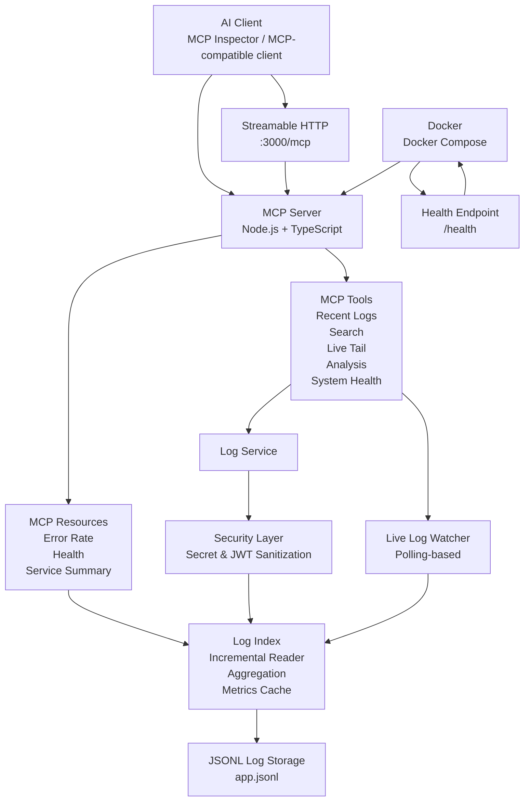

# MCP Live Developer Logs & Observability Server

A production-oriented **Model Context Protocol (MCP) server** that gives AI clients structured access to live application logs, observability metrics, health information, and real-time log streams.

Built with **Node.js, TypeScript, MCP, Docker, and Streamable HTTP**.

---

## Overview

Modern applications generate large volumes of logs, but developers and AI assistants often need a structured way to inspect those logs and understand application health.

This project provides an MCP server that exposes application logs through MCP tools and resources.

The server can:

* Retrieve recent logs
* Search logs
* Stream live logs
* Analyze error and warning patterns
* Calculate service-level health metrics
* Expose observability metrics through MCP resources
* Sanitize sensitive values before logs are exposed
* Run through Streamable HTTP
* Run inside Docker
* Recover from log-file truncation/replacement
* Maintain incremental log indexes and cached metrics
* Provide HTTP health checks
* Shut down gracefully
* Validate builds automatically through GitHub Actions

---

## Architecture



## Key Features

### 1. Recent Log Retrieval

Retrieve recent application logs with filtering support.

The server supports:

* Log level filtering
* Configurable result limits
* Time-window filtering
* Safe error handling

Example:

```text
get_recent_logs
```

---

### 2. Log Search

Search across application logs using a case-insensitive query.

Searches can match:

* Log messages
* Services
* Log levels

Example:

```text
search_logs
```

---

### 3. Live Log Streaming

Stream newly generated logs to an MCP client.

The server supports:

* Real-time log watching
* Duration limits
* Maximum log limits
* Log-level filtering
* Service filtering
* MCP logging notifications

The watcher uses polling rather than relying exclusively on filesystem events, which allows live log streaming to work with the Docker development environment using a Windows-mounted log volume.

---

### 4. Log Analysis

The analytics layer calculates observability metrics such as:

* Total logs
* INFO count
* WARNING count
* ERROR count
* Error rate
* Warning rate
* Errors by service
* Error rate by service
* Service health
* Severity score
* Error trend
* Anomaly detection
* Recommendations

Example:

```text
analyze_logs
```

---

### 5. Service Health

Each service can be analyzed independently.

Supported example services:

```text
api-service
auth-service
payment-service
database-service
```

The system classifies service health as:

```text
HEALTHY
WARNING
CRITICAL
```

based on the calculated error rate.

---

### 6. MCP Resources

The server exposes observability information through MCP resources.

Resource templates include:

```text
metrics://{service}/error-rate
metrics://{service}/health
metrics://{service}/summary
```

These provide structured JSON information about individual services.

---

### 7. Security / Log Sanitization

Logs are sanitized before being exposed through MCP.

The sanitizer detects and redacts common sensitive values including:

* Passwords
* API keys
* Authorization bearer tokens
* Tokens
* Secrets
* JWTs

Example:

```text
password: "my-secret-password"
```

becomes:

```text
password: "[REDACTED]"
```

The original log file is not modified by the sanitization process.

---

### 8. Incremental Log Processing

The server maintains an in-memory log index to avoid repeatedly rebuilding the complete log dataset.

The storage layer supports:

* Incremental reading
* File-position tracking
* Per-service aggregation
* Metrics caching
* Log rotation handling
* Recovery after file truncation/replacement

---

### 9. Streamable HTTP

The server supports MCP Streamable HTTP.

Endpoint:

```text
http://localhost:3000/mcp
```

This allows MCP clients to communicate with the server over HTTP rather than only through stdio.

---

### 10. Docker

The project includes Docker support.

Build and start:

```powershell
docker compose up -d --build
```

Check running containers:

```powershell
docker ps
```

The MCP server runs on:

```text
http://localhost:3000
```

---

### 11. Health Check

The HTTP server exposes:

```text
GET /health
```

Example response:

```json
{
  "status": "healthy",
  "service": "mcp-log-server"
}
```

Docker also uses this endpoint for its container healthcheck.

---

### 12. Graceful Shutdown

The server handles shutdown signals and closes the HTTP server cleanly.

This helps prevent abrupt termination of active server resources.

---

### 13. Continuous Integration

GitHub Actions automatically runs the TypeScript build on:

* Pushes to `master`
* Pull requests targeting `master`

Workflow:

```text
.github/workflows/ci.yml
```

The CI pipeline installs dependencies and verifies that the project builds successfully.

---

## MCP Tools

| Tool              | Purpose                                     |
| ----------------- | ------------------------------------------- |
| `get_recent_logs` | Retrieve recent application logs            |
| `search_logs`     | Search logs by query                        |
| `tail_live_logs`  | Stream newly generated logs                 |
| `analyze_logs`    | Analyze application health and log patterns |
| `system_health`   | Check overall system health                 |

---

## MCP Resources

| Resource                         | Purpose                                |
| -------------------------------- | -------------------------------------- |
| `metrics://{service}/error-rate` | Service error rate                     |
| `metrics://{service}/health`     | Service health status                  |
| `metrics://{service}/summary`    | Detailed service observability summary |

---

## Technology Stack

### Backend

* Node.js
* TypeScript
* MCP SDK
* Zod

### Data / Logging

* JSONL
* Incremental file processing
* In-memory indexing
* Log aggregation
* Metrics caching

### Infrastructure

* Docker
* Docker Compose
* Streamable HTTP

### Development

* Git
* GitHub
* GitHub Actions
* MCP Inspector

---

## Project Structure

mcp/
│
├── src/
│   ├── index.ts
│   ├── server.ts
│   ├── http-server.ts
│   ├── config.ts
│   ├── system-health.ts
│   ├── log-service.ts
│   ├── log-generator.ts
│   ├── live-log-watcher.ts
│   ├── types.ts
│   ├── logger.ts
│   ├── log-statistics.ts
│   │
│   ├── tools/
│   │   ├── recent-logs.ts
│   │   ├── search-logs.ts
│   │   ├── analyze-logs.ts
│   │   ├── tail-live-logs.ts
│   │   └── system-health.ts
│   │
│   ├── storage/
│   │   ├── log-storage.ts
│   │   ├── incremental-log-reader.ts
│   │   ├── log-aggregator.ts
│   │   ├── log-index.ts
│   │   ├── log-rotation.ts
│   │   ├── log-writer.ts
│   │   ├── streaming-log-reader.ts
│   │   ├── streaming-log-statistics.ts
│   │   └── metrics-cache.ts
│   │
│   ├── security/
│   │   ├── log-sanitizer.ts
│   │   └── sanitize-logs.ts
│   │
│   └── resources/
│       └── metrics.ts
│
├── logs/
├── Dockerfile
├── docker-compose.yml
├── .dockerignore
├── .github/
│   └── workflows/
│       └── ci.yml
├── package.json
└── tsconfig.json

---

## Running Locally

### 1. Install dependencies

```powershell
npm install
```

### 2. Build the project

```powershell
npx tsc
```

### 3. Start the MCP server using stdio

```powershell
node .\dist\index.js
```

### 4. Start the HTTP MCP server

```powershell
node .\dist\http-server.js
```

The Streamable HTTP endpoint is:

```text
http://localhost:3000/mcp
```

---

## Running with Docker

Build and start:

```powershell
docker compose up -d --build
```

Check the container:

```powershell
docker ps
```

Check health:

```powershell
Invoke-WebRequest http://localhost:3000/health |
  Select-Object -ExpandProperty Content
```

Stop the application:

```powershell
docker compose down
```

---

## Testing with MCP Inspector

The project can be tested using MCP Inspector.

For stdio:

```powershell
npx @modelcontextprotocol/inspector node .\dist\index.js
```

For the HTTP server, connect Inspector to:

```text
http://localhost:3000/mcp
```

The following functionality has been tested:

* Recent log retrieval
* Log searching
* Log analysis
* Live log streaming
* System health
* MCP resources
* Streamable HTTP
* Docker deployment
* Docker healthcheck
* Log sanitization
* Graceful shutdown

---

## Configuration

The server supports environment-based configuration.

Examples:

```text
PORT
LOG_FILE
LOG_MAX_FILE_SIZE
LOG_MAX_BACKUPS
METRICS_CACHE_MAX_AGE_MS
```

Example:

```text
PORT=3000
LOG_FILE=logs/app.jsonl
LOG_MAX_FILE_SIZE=1048576
LOG_MAX_BACKUPS=5
METRICS_CACHE_MAX_AGE_MS=5000
```

---

## Engineering Highlights

This project was designed to demonstrate practical backend engineering concepts rather than only a basic MCP tool implementation.

Key engineering areas include:

* Modular TypeScript architecture
* MCP tool and resource design
* Event-driven log processing
* Incremental file reading
* In-memory indexing
* Streaming analytics
* Metrics caching
* Error handling and recovery
* Log rotation handling
* Secret sanitization
* HTTP transport
* Docker containerization
* Health monitoring
* Graceful shutdown
* Continuous integration

---

## Future Improvements

Potential future improvements include:

* Persistent database-backed log storage
* Distributed log ingestion
* Authentication and authorization
* OpenTelemetry integration
* Prometheus metrics
* Production-grade log collectors
* Multi-instance deployment
* Advanced anomaly detection
* Additional MCP resource types

---

## Author

**Punith Sagar**

B.Tech — Electrical & Electronics Engineering

Interested in:

* Backend Engineering
* AI Developer Tools
* MCP
* Observability
* Developer Infrastructure
* Software Engineering
